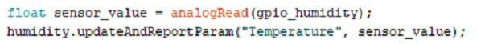

# YAKU esp32 rainmaker
Este codigo es parte de un proyecto llamado **Yaku** de los estudiantes de la ***ET36 D.E. 15***,
el cual tiene como objetivo crear una huerta inteligente para el uso de ***Escuela de Discapacitados Motores Nº 1 D.E 15.***

## Como funciona el codigo

## GUIA RAINMAKER (YAKU)

Paso a paso de como crear un nodo, como crear un dispositivo y como subir los datos a la app de RAINMAKER.

El primer paso es crear el sensor dentro del código. Para realizar esto tendrás que escribir una variable del tipo del sensor* (de ahora en más llamaremos a estos **DISPOSITIVOS**) seguido del nombre que le quieras atribuir a este dentro del código además del nombre dentro de la app. Esto se definiría de la siguiente manera:

En este caso estamos creando un dispositivo de temperatura (Ya que Rainmaker no tiene de humedad), con el nombre **humidity** tanto dentro del codigo como en la app.

> **Rainmaker nos proporciona 4 tipos de dispositivos, los cuales son TemperatureSensor, Switch, Fan y LightBulb.*

Lo siguiente es crear el nodo (Asi llamaremos a nuestra ESP32) e iniciarlo, para esto crearemos una variable tipo Node y la iniciaremos de la siguiente manera:

El parametro que toma RMaker.initNode() es el nombre que le daremos al nodo, en este caso el nodo se llama ET.36.

Lo que sigue es agregar nuestro dispositivo al nodo, lo cual se hace utilizando el metodo addDevice() y utilizando como parametro el dispositivo creado anteriormente (Este paso se tiene que realizar con cada dispositivo que creemos).

Hasta ahora ya tenemos creado nuestro primer dispositivo, creado nuestro nodo y ademas añadido el dispositivo al nodo. Ahora toca leer los datos del dispositivo y subirlos a la app.

Para realizar esto lo que haremos sera leer el pin al cual tenemos conectado el dispositivo y asignar este valor una variable. Luego utilizando la variable de nuestro dispositivo usaremos el metodo updateAndReportParam() el cual tiene como parametros el tipo de sensor que es (En este caso es Temperature) y el valor que le queramos subir.

